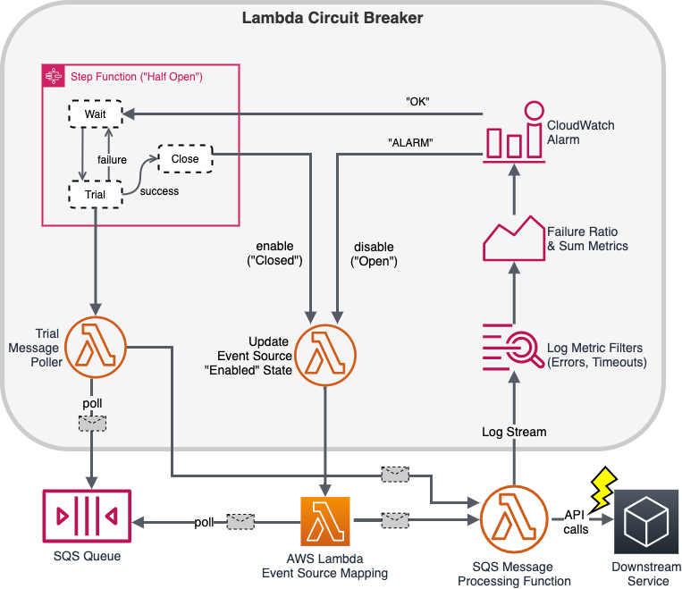

# Circuit Breaker Solution for AWS Lambda
A [Circuit Breaker for AWS Lambda Functions](https://medium.com/@ch.gerkens/circuit-breaker-solution-for-aws-lambda-functions-5264cb59031f) that are triggered via Event Source Mappings (like Amazon SQS).



## Sources
This project contains source code and supporting files for a serverless application that you can deploy with the AWS Serverless Application Model (AWS SAM) command line interface (CLI). It includes the following files and folders:

- `template.yml` - A template that defines the circuit breaker AWS resources.
- `src` - Code for the Lambda functions used by the circuit breaker.
- `examples` - Examples that shows how to use the circuit breaker.

Resources for this project are defined in the `template.yml` file in this project. 

## Deploy the Solution

### AWS SAM CLI

To use the AWS SAM CLI, you need the following tools:

* AWS SAM CLI - [Install the AWS SAM CLI](https://docs.aws.amazon.com/serverless-application-model/latest/developerguide/serverless-sam-cli-install.html).
* Node.js - [Install Node.js 12](https://nodejs.org/en/), including the npm package management tool.

To build and deploy your application for the first time, run the following in your shell:

```bash
sam build
sam deploy --guided
```

The first command will build the source of the application. The second command will package and deploy your application to AWS, with a series of prompts:

* **Stack Name**: The name of the stack to deploy to CloudFormation. This should be unique to your account and region, and a good starting point would be something matching your target lambda function.
* **AWS Region**: The AWS region you want to deploy your app to. 
* **Parameter TargetFunctionName**: mandatory, name of the existing Lambda function
* **Parameter TargetQueueName**: mandatory, name of the existing SQS queue

You may accept default values for the following parameters

* Parameter ProvidedCloudwatchAlarmArn: optional 
* Parameter FailureLogFilterPattern: optional, default exists
* Parameter PeriodBetweenTrialInvocationsInSeconds: optional, default exists
* Parameter DefaultAlarmPeriodInSeconds: optional, default exists
* Parameter DefaultAlarmEvaluationPeriods: 
* Parameter DefaultAlarmFailureSumThreshold: 
* Parameter DefaultAlarmFailurePercentageThreshold: 
* Parameter LogRetentionInDays: 
* **Confirm changes before deploy**: If set to yes, any change sets will be shown to you before execution for manual review. If set to no, the AWS SAM CLI will automatically deploy application changes.
* **Allow SAM CLI IAM role creation**: Many AWS SAM templates, including this example, create AWS IAM roles required for the AWS Lambda function(s) included to access AWS services. By default, these are scoped down to minimum required permissions. To deploy an AWS CloudFormation stack which creates or modified IAM roles, the `CAPABILITY_IAM` value for `capabilities` must be provided. If permission isn't provided through this prompt, to deploy this example you must explicitly pass `--capabilities CAPABILITY_IAM` to the `sam deploy` command.
* **Save arguments to samconfig.toml**: If set to yes, your choices will be saved to a configuration file inside the project, so that in the future you can just re-run `sam deploy` without parameters to deploy changes to your application.

Open the [**Applications**](https://console.aws.amazon.com/lambda/home#/applications) page of the Lambda console, and choose your application. When the deployment completes, view the application resources on the **Overview** tab.


## Examples
- [AWS Serverless Application Model (SAM) example](./examples/example-sam/README.md)

## Cleanup

To delete the sample application and the bucket that you created, use the AWS CLI.

```bash
my-application$ aws cloudformation delete-stack --stack-name sam-app
my-application$ aws s3 rb s3://BUCKET_NAME
```
